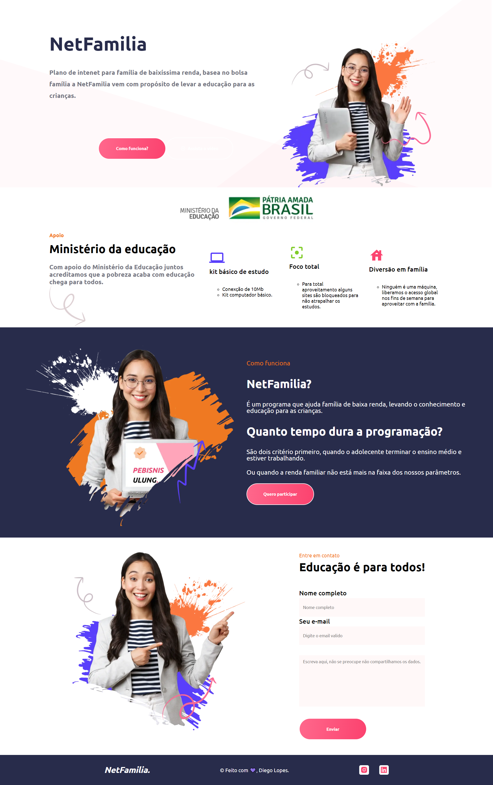

# NetFamilia | Desafio da Rocketseat evento DoWhile

##### O intuido do desafio é criar um landing page com um proposito de solucionar uma dor, o acesso à educação hoje utilizando a tecnologia, então criei NetFamilia baseado no Bolsa Familia o proposito da NetFamilia e ajudar família de baixa renda ter acesso a educação de ensino.

<h2> Technologies 🚀 </h2>
<li><a href="https://reactnative.dev/">ReactJS</a></li>
<li><a href="https://www.typescriptlang.org/">TypeScript</a></li>
<li><a href="https://nextjs.org/docs/getting-started">Nextjs</a></li>
<li><a href="https://axios-http.com/docs/intro">Axios</a></li>
<li><a href="https://fkhadra.github.io/react-toastify/introduction">React Toastify</a></li>

<h2> Software Requirements 🔍</h2>

<li><a href="https://yarnpkg.com/">Install Yarn</a></li>
<!-- <li><a href="https://nodejs.org/en/">Install NodeJs</a></li> -->

<h2> Installing and running the project 🎲</h2>

```bash
# Clone este repositório
$ git clone https://github.com/Diego-Lopes/desafioDoWhile

# Acesse a pasta do projeto no seu terminal/cmd
$ cd desafioDoWhile

# Instale as dependências
$ yarn

# Inicie o Build
$ yarn build

# Inicie o Start
$ yarn start

```

<br/>



<br />
<hr />
<p align=center>Made with 💜 by <a href="https://www.linkedin.com/in/diego-lopes-37877a105/">Diego da Silva Lopes</a><p>
